Stock Analysis of IMBBY
================

This is an [R Markdown](http://rmarkdown.rstudio.com) Notebook. When you
execute code within the notebook, the results appear beneath the code.

Try executing this chunk by clicking the *Run* button within the chunk
or by placing your cursor inside it and pressing *Ctrl+Shift+Enter*.

``` r
library(quantmod)
```

    ## Loading required package: xts

    ## Loading required package: zoo

    ## Warning: package 'zoo' was built under R version 4.0.5

    ## 
    ## Attaching package: 'zoo'

    ## The following objects are masked from 'package:base':
    ## 
    ##     as.Date, as.Date.numeric

    ## Loading required package: TTR

    ## Registered S3 method overwritten by 'quantmod':
    ##   method            from
    ##   as.zoo.data.frame zoo

``` r
library(rugarch)
```

    ## Warning: package 'rugarch' was built under R version 4.0.5

    ## Loading required package: parallel

    ## 
    ## Attaching package: 'rugarch'

    ## The following object is masked from 'package:stats':
    ## 
    ##     sigma

``` r
library(forecast)
```

    ## Warning: package 'forecast' was built under R version 4.0.5

``` r
library(tseries)
library(PerformanceAnalytics)
```

    ## 
    ## Attaching package: 'PerformanceAnalytics'

    ## The following object is masked from 'package:graphics':
    ## 
    ##     legend

Add a new chunk by clicking the *Insert Chunk* button on the toolbar or
by pressing *Ctrl+Alt+I*.

When you save the notebook, an HTML file containing the code and output
will be saved alongside it (click the *Preview* button or press
*Ctrl+Shift+K* to preview the HTML file).

The preview shows you a rendered HTML copy of the contents of the
editor. Consequently, unlike *Knit*, *Preview* does not run any R code
chunks. Instead, the output of the chunk when it was last run in the
editor is displayed.

``` r
getSymbols("IMBBY")
```

    ## 'getSymbols' currently uses auto.assign=TRUE by default, but will
    ## use auto.assign=FALSE in 0.5-0. You will still be able to use
    ## 'loadSymbols' to automatically load data. getOption("getSymbols.env")
    ## and getOption("getSymbols.auto.assign") will still be checked for
    ## alternate defaults.
    ## 
    ## This message is shown once per session and may be disabled by setting 
    ## options("getSymbols.warning4.0"=FALSE). See ?getSymbols for details.

    ## [1] "IMBBY"

``` r
#View(IMBBY)
summary(IMBBY)
```

    ##      Index              IMBBY.Open      IMBBY.High      IMBBY.Low    
    ##  Min.   :2007-01-03   Min.   :15.01   Min.   :15.22   Min.   :14.42  
    ##  1st Qu.:2010-07-30   1st Qu.:30.00   1st Qu.:30.17   1st Qu.:29.71  
    ##  Median :2014-02-27   Median :36.74   Median :36.99   Median :36.52  
    ##  Mean   :2014-02-26   Mean   :36.80   Mean   :37.04   Mean   :36.55  
    ##  3rd Qu.:2017-09-24   3rd Qu.:44.55   3rd Qu.:44.76   3rd Qu.:44.25  
    ##  Max.   :2021-04-23   Max.   :55.60   Max.   :55.84   Max.   :55.34  
    ##   IMBBY.Close     IMBBY.Volume     IMBBY.Adjusted 
    ##  Min.   :14.70   Min.   :   8600   Min.   :10.48  
    ##  1st Qu.:29.89   1st Qu.:  44250   1st Qu.:17.91  
    ##  Median :36.73   Median :  76200   Median :21.60  
    ##  Mean   :36.80   Mean   : 148952   Mean   :23.17  
    ##  3rd Qu.:44.54   3rd Qu.: 157800   3rd Qu.:28.36  
    ##  Max.   :55.55   Max.   :2339000   Max.   :38.43

``` r
chartSeries(IMBBY["2021-4"])
```

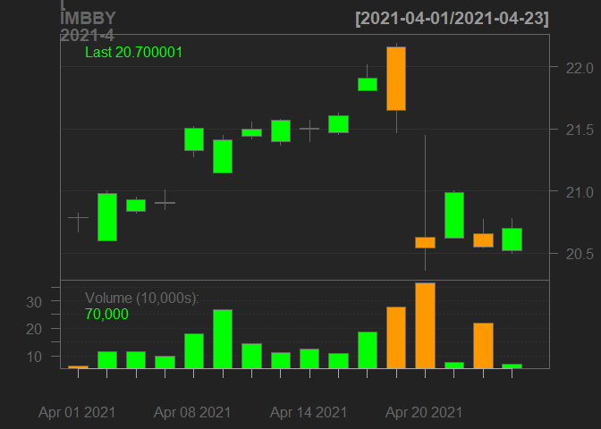<!-- -->

``` r
chartSeries(IMBBY)
```

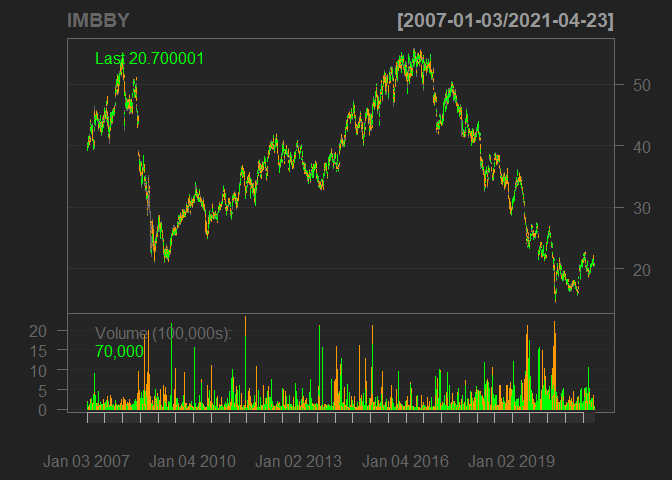<!-- -->

``` r
addBBands()
```

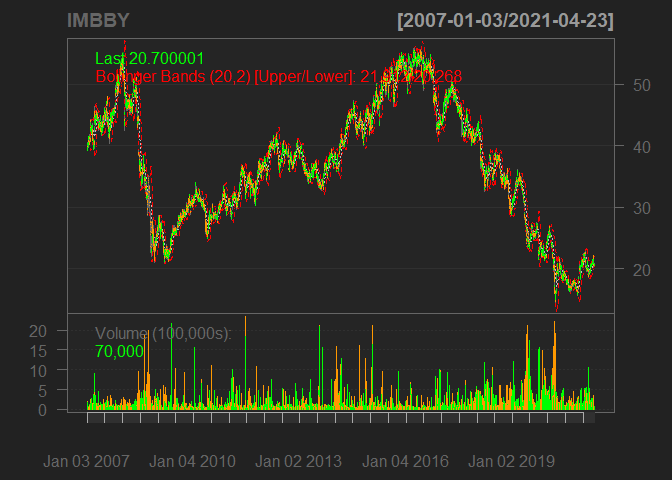<!-- -->
Get Returns

``` r
returns <- CalculateReturns(IMBBY$IMBBY.Close)
returns <- returns[-1]
hist(returns)
```

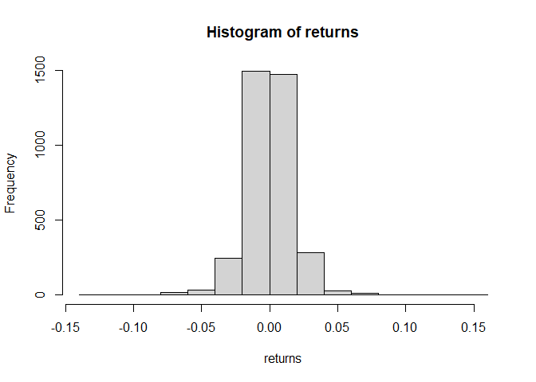<!-- -->

``` r
chart.Histogram(returns,
                methods = c('add.density','add.normal'),
                colorset = c('yellow','red','blue'))
```

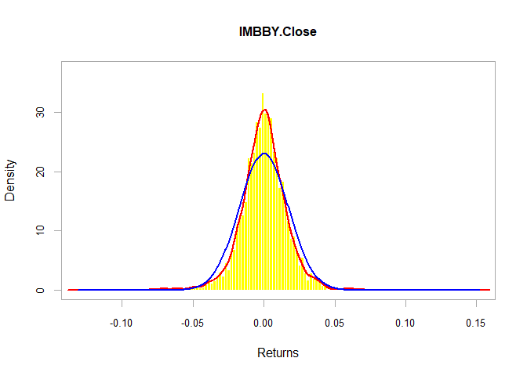<!-- -->

``` r
chartSeries(returns,theme = 'white')
```

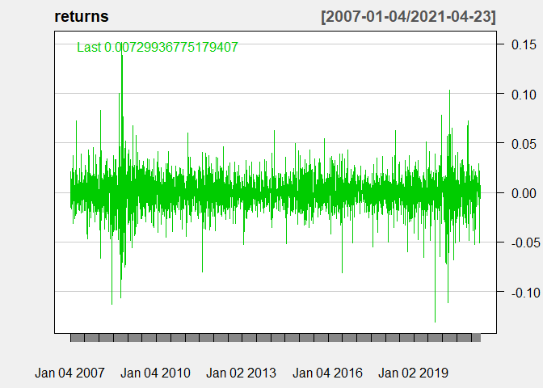<!-- -->

ARIMA Model

``` r
modelfit <- auto.arima(IMBBY$IMBBY.Close,lambda = "auto")
modelfit
```

    ## Series: IMBBY$IMBBY.Close 
    ## ARIMA(1,1,1) 
    ## Box Cox transformation: lambda= 0.6774303 
    ## 
    ## Coefficients:
    ##          ar1      ma1
    ##       0.7504  -0.7846
    ## s.e.  0.1344   0.1262
    ## 
    ## sigma^2 estimated as 0.03529:  log likelihood=912.65
    ## AIC=-1819.3   AICc=-1819.3   BIC=-1800.74

``` r
boxplot(modelfit$residuals)
```

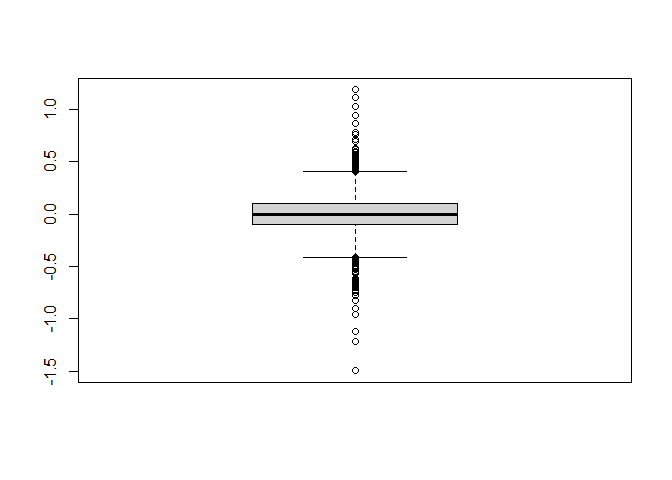<!-- -->
Stationarity Test

``` r
adf.test(IMBBY$IMBBY.Close)
```

    ## 
    ##  Augmented Dickey-Fuller Test
    ## 
    ## data:  IMBBY$IMBBY.Close
    ## Dickey-Fuller = -1.2713, Lag order = 15, p-value = 0.8869
    ## alternative hypothesis: stationary

Autocorrelation timeseries

``` r
Acf(IMBBY$IMBBY.Close)
```

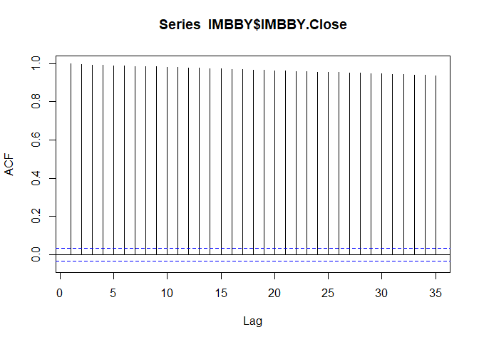<!-- -->

``` r
Pacf(IMBBY$IMBBY.Close)
```

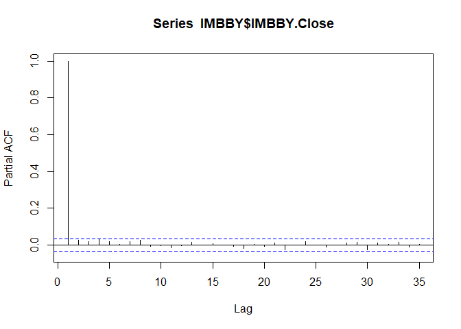<!-- -->

``` r
ret_IMBBY <- 100 * diff(log(IMBBY$IMBBY.Close[3300:3600]))
len_IMBBY <- length(ret_IMBBY)
train <- ret_IMBBY[1:(0.9*len_IMBBY)]
fit <- Arima(train, order= c(2,0,2))
fit
```

    ## Series: train 
    ## ARIMA(2,0,2) with non-zero mean 
    ## 
    ## Coefficients:
    ##           ar1      ar2     ma1     ma2     mean
    ##       -0.1773  -0.6235  0.2659  0.7403  -0.0861
    ## s.e.   0.2218   0.1872  0.1899  0.1664   0.1586
    ## 
    ## sigma^2 estimated as 5.56:  log likelihood=-609.97
    ## AIC=1231.94   AICc=1232.26   BIC=1253.51

``` r
preds <- predict(fit,n.head = len_IMBBY-(0.9*len_IMBBY))$pred
preds
```

    ## Time Series:
    ## Start = 271 
    ## End = 271 
    ## Frequency = 1 
    ## [1] 0.1033104

``` r
test_forecast <- forecast(fit,h=25)
plot(test_forecast, main = "IMBBY ARIMA forecast")
```

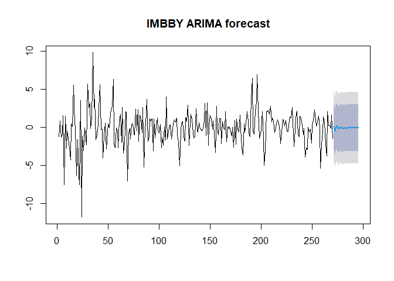<!-- -->

``` r
accuracy(test_forecast)
```

    ##                         ME     RMSE      MAE MPE MAPE      MASE       ACF1
    ## Training set -0.0005273393 2.335866 1.681831 NaN  Inf 0.7334517 0.01381142

``` r
accuracy(test_forecast)
```

    ##                         ME     RMSE      MAE MPE MAPE      MASE       ACF1
    ## Training set -0.0005273393 2.335866 1.681831 NaN  Inf 0.7334517 0.01381142

``` r
Box.test(modelfit$residuals,lag = 2 ,type="Ljung-Box")
```

    ## 
    ##  Box-Ljung test
    ## 
    ## data:  modelfit$residuals
    ## X-squared = 0.91095, df = 2, p-value = 0.6341

``` r
Box.test(modelfit$residuals,type="Ljung-Box")
```

    ## 
    ##  Box-Ljung test
    ## 
    ## data:  modelfit$residuals
    ## X-squared = 0.087638, df = 1, p-value = 0.7672

``` r
plot(as.ts(IMBBY$IMBBY.Close),col = "red")
```

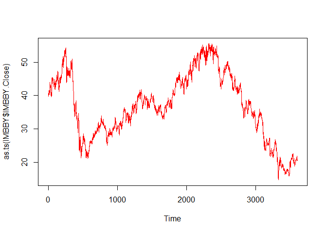<!-- -->

``` r
price_forecast <- forecast(modelfit,h=20)
plot(price_forecast, col="darkgreen")
```

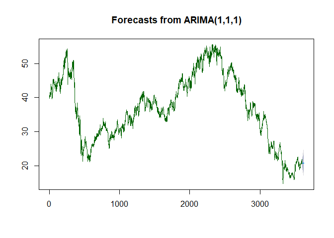<!-- -->

``` r
head(price_forecast$mean)
```

    ## Time Series:
    ## Start = 3603 
    ## End = 3608 
    ## Frequency = 1 
    ## [1] 20.71323 20.72316 20.73062 20.73621 20.74041 20.74355

``` r
head(price_forecast$lower)
```

    ## Time Series:
    ## Start = 3603 
    ## End = 3608 
    ## Frequency = 1 
    ##           80%      95%
    ## 3603 20.07650 19.74205
    ## 3604 19.83957 19.37687
    ## 3605 19.66539 19.10887
    ## 3606 19.52251 18.88965
    ## 3607 19.39884 18.70047
    ## 3608 19.28827 18.53184

``` r
head(price_forecast$upper)
```

    ## Time Series:
    ## Start = 3603 
    ## End = 3608 
    ## Frequency = 1 
    ##           80%      95%
    ## 3603 21.35634 21.69934
    ## 3604 21.61908 22.09828
    ## 3605 21.81380 22.39437
    ## 3606 21.97327 22.63742
    ## 3607 22.11057 22.84725
    ## 3608 22.23255 23.03414

``` r
N <- length(IMBBY$IMBBY.Close)
n <- 0.7*N

train <- IMBBY$IMBBY.Close[1:n,]
test <- IMBBY$IMBBY.Close[(n+1):N,]

trainarimafit <- auto.arima(train, lambda = "auto")
predlen=length(test)
head(predlen)
```

    ## [1] 1080

``` r
trainarimafit <- forecast(trainarimafit, h=predlen)
#head(trainarimafit)
meanvalues <- as.vector(trainarimafit$mean)
precios <- as.vector(test$IMBBY.Close)
par(plot(meanvalues,type="l",col ="red"))
```

    ## named list()

``` r
lines(precios,type = "l")
```

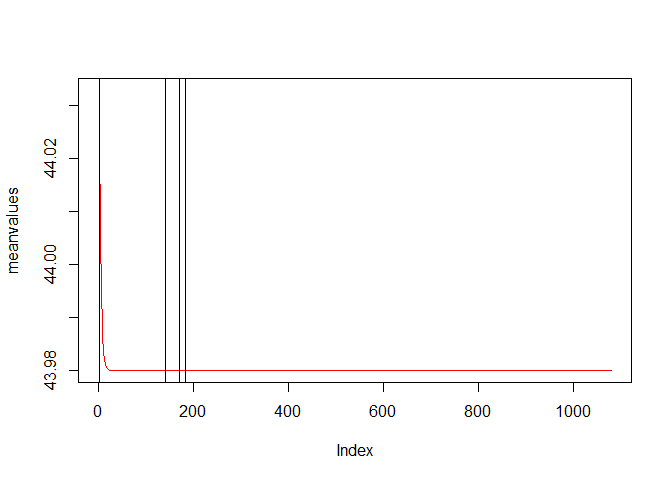<!-- -->

``` r
#We convert dataset as prophet input requires
df <- data.frame(ds = index(IMBBY),
                 y = as.numeric(IMBBY[,'IMBBY.Close']))

#Annualized volatility
sd(returns)
```

    ## [1] 0.01735659

``` r
charts.RollingPerformance(R = returns["2008::2020"],
                          width = 23,
                          fun = "sd.annualized",
                          scale = 252,
                          main = "IMBBY's monthly rolling volatility")
```

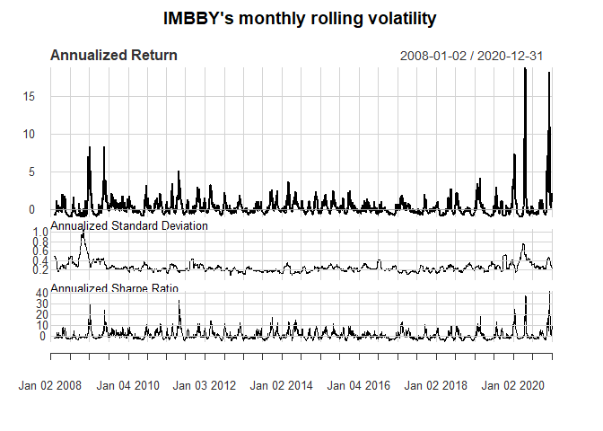<!-- -->

``` r
library(prophet)
```

    ## Warning: package 'prophet' was built under R version 4.0.5

    ## Loading required package: Rcpp

    ## Warning: package 'Rcpp' was built under R version 4.0.5

    ## Loading required package: rlang

    ## Warning: package 'rlang' was built under R version 4.0.5

``` r
prophetpred <- prophet(df,daily.seasonality = TRUE)
future <- make_future_dataframe(prophetpred, periods = 30)
forecastprophet <- predict(prophetpred, future)

par(plot(future,type="l",col="red"))
```

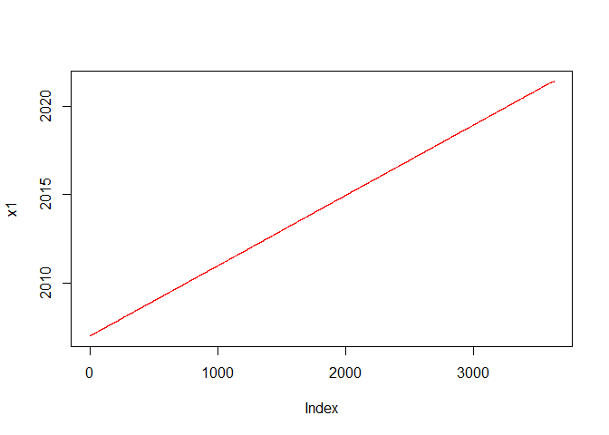<!-- -->

    ## named list()
